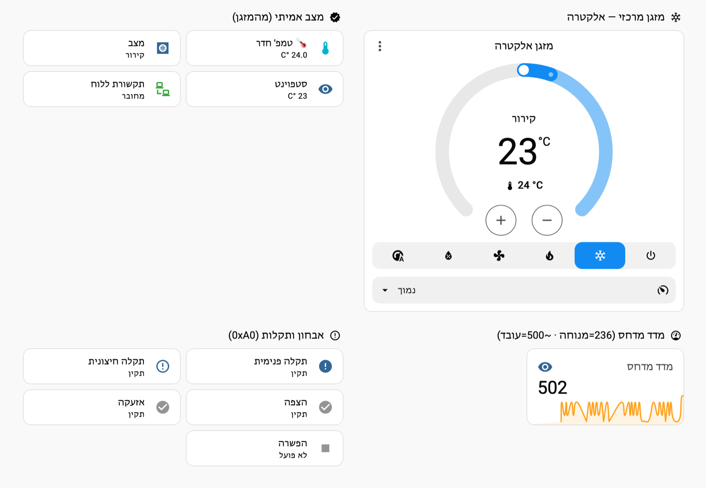
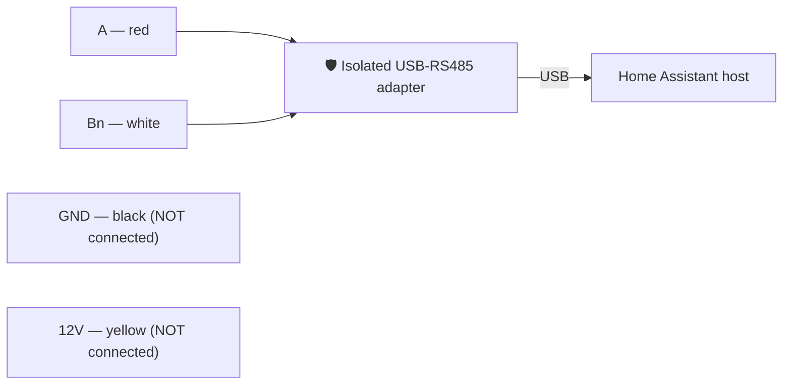
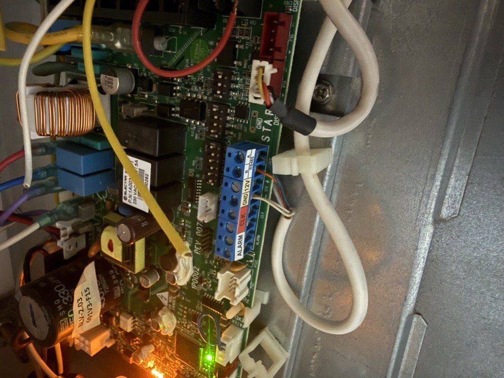

# Electra Star — Local Modbus Control (Home Assistant)

Fully **local** control and monitoring of an **Electra "Star" mini-central inverter A/C** (IDU controller) over **Modbus RTU / RS‑485** — no cloud, no app, and no commercial BMS adapter.

Turn on/off, set **mode / fan / target temperature**, and read the **real room temperature, setpoint, mode, and fault codes** straight from the indoor unit's control board, exposed in Home Assistant as a native `climate` entity.



*The result in Home Assistant — a native round thermostat (**cool · 23 °C** set, **24 °C** room) driven entirely over Modbus, with the **real state read back from slave `0xA0`** (mode, room temp, setpoint, board link), a live **compressor-load** graph (`236` idle → `~500` running), and **fault diagnostics**.*

> 🙏 Thanks to **Electra's technical team** for the official made the register mapping possible.

---

## How it works

The Star IDU controller exposes a **Modbus RTU slave** on its BMS/external‑control port (the RS‑485 `A`/`Bn` pair). Two things were key to getting real data out of it:

1. **Two slave addresses.** The board answers on **slave `0xA0`** with the *documented* BMS register map (real values), and also on **slave `1`** with an internal RAM‑style window whose reads are address‑masked to the low 8 bits (so `0x3303` there reads register `3` = `0`). **Read state from `0xA0`.**
2. **Writes** to the control registers work and are reflected back in the `0xA0` reads, so this project **reads state from `0xA0`** and **writes control** in one `0x3300` block.

### Wiring — use an **isolated** RS-485 adapter

> ⚠️ **Use a galvanically-isolated USB-RS485 adapter.** The BMS connector shares the A/C's ground and carries a 12 V rail; a *non-isolated* adapter creates a ground-loop / common-mode offset that corrupts the signal and can **fry the RS-485 transceiver** (we let the magic smoke out doing exactly that). An isolated adapter — opto/transformer isolation between the USB side and the RS-485 side — costs a couple of dollars more and saves a lot of pain.

> 🔌 **This is a wired integration.** It needs a physical RS-485 connection between the A/C control board and the machine running Home Assistant — there is no wireless path.

Connect **only the data pair** — with an isolated adapter this is a **2-wire** hookup (the doc's "data only" option); **GND *and* 12 V stay unconnected.**

| 4-pin BMS connector | Wire (typical) | Use |
|---|---|---|
| Data pair | red + white | RS-485 **A / Bn** — the **only** wires you connect (swap if no reply) |
| Common (GND) | black | **not connected** |
| 12 V | yellow | ⚠️ **not connected** |

`9600 8N1`, half-duplex. Enable Modbus on the board (DIP **J12 = ON** on Star).



The real board — the RS-485 terminal block (`ALARM · CLK · GND · 12V · B · A`, marked **R485**); only the **A/B data pair** is wired (GND and 12 V left empty):



### Register map (holding registers)
| Addr | Meaning | Values |
|---|---|---|
| `0x3300` | Mode | 0 STBY · 1 Cool · 2 Heat · 3 Auto · 4 Dry · 5 Fan |
| `0x3301` | Fan | 0 Low · 1 Med · 2 High · 3 Auto · 4 Turbo · 5 VLow |
| `0x3302` | Setpoint | 16–30 °C |
| `0x3303` | **Room temp** (RO) | −30…75 °C |
| `0x3304` / `0x3305` | IDU / ODU fault code (RO) | see Electra fault table |
| `0x330F`/`0x3310`/`0x3311` | Defrost / Overflow / Alarm (RO) | `0x0A` = active |

*(Register semantics are per Electra's official BMS spec; only the addresses needed for interoperability are summarised here — the proprietary document itself is not redistributed.)*

---

## Contents
- **`packages/electra_ac.yaml`** — a self‑contained Home Assistant package: the `modbus` hub, real‑state sensors (slave `0xA0`), an MQTT `climate` entity (round thermostat), control helpers, fault‑text and diagnostic sensors, and a "resend every minute" hold against the wall panel.
- **`electra_ac.py`** — a zero‑dependency‑ish CLI (`pyserial`) to read state and set mode/fan/temp from any machine with the adapter.

## Home Assistant setup
1. Copy `packages/electra_ac.yaml` to `config/packages/`.
2. In `configuration.yaml`:
   ```yaml
   homeassistant:
     packages: !include_dir_named packages
   ```
3. Set the `port:` in the package to your adapter (a stable `/dev/serial/by-id/...` path is best).
4. Restart Home Assistant. You get a `climate.electra_ac` entity with a native thermostat card.

> Note: some boards answer at slave `1` instead of `0xA0` (address changed via `0x330A`). Scan `{1, 0xA0…0xAA}` if it doesn't respond.

## CLI usage
```bash
pip install pyserial
python electra_ac.py read
python electra_ac.py on  --mode cool --fan low --temp 24
python electra_ac.py off
python electra_ac.py --port /dev/ttyUSB0 set --temp 22
```

## Notes / gotchas
- The wall panel is an active controller and will re‑assert its setpoint; the package **resends the desired state every minute** to hold it (the doc's "Continuous" scheme). Or disconnect the panel.
- CRCs are standard CRC‑16/Modbus (poly `0xA001`); regenerate any hand‑built frame in code.

## Disclaimer
Community reverse‑engineering for interoperability with hardware you own. Not affiliated with or endorsed by Electra. Use at your own risk; writing to an A/C control bus can affect operation.

## License
MIT — see [LICENSE](LICENSE).
